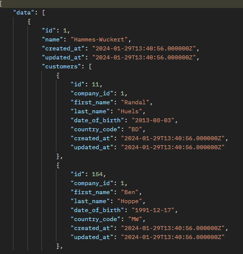

<h1>API CRUD (Laravel)</h1>

A simple CRUD api made with laravel. <br />
No authentication needed.



<hr>
<h2>Installation</h2>

> [!WARNING]  
> Make sure to follow the requirements first!

<p>Here is how you can run the project locally:</p>

1. Clone this repo.

```
git clone https://github.com/TheBaldCoder/api-crud.git
```

2. Go into the project root directory.

```
cd api-crud
```

3. Copy .env.example file to .env file.

```
cp .env.example .env
```


4. Create the database.

5. Go to .env file.

    * set database credentials (DB_DATABASE=laravel, DB_USERNAME=root, DB_PASSWORD=)

> [!WARNING]  
> Make sure to use your own database username and password!


6. Install PHP dependencies.
```
composer install
```

7. Generate key.
```
php artisan key:generate
```

8. Run migration.
```
php artisan migrate
```

9. Run seeder. (optional)
```
php artisan db:seed
```

10. Run server.
```
php artisan serve
```
